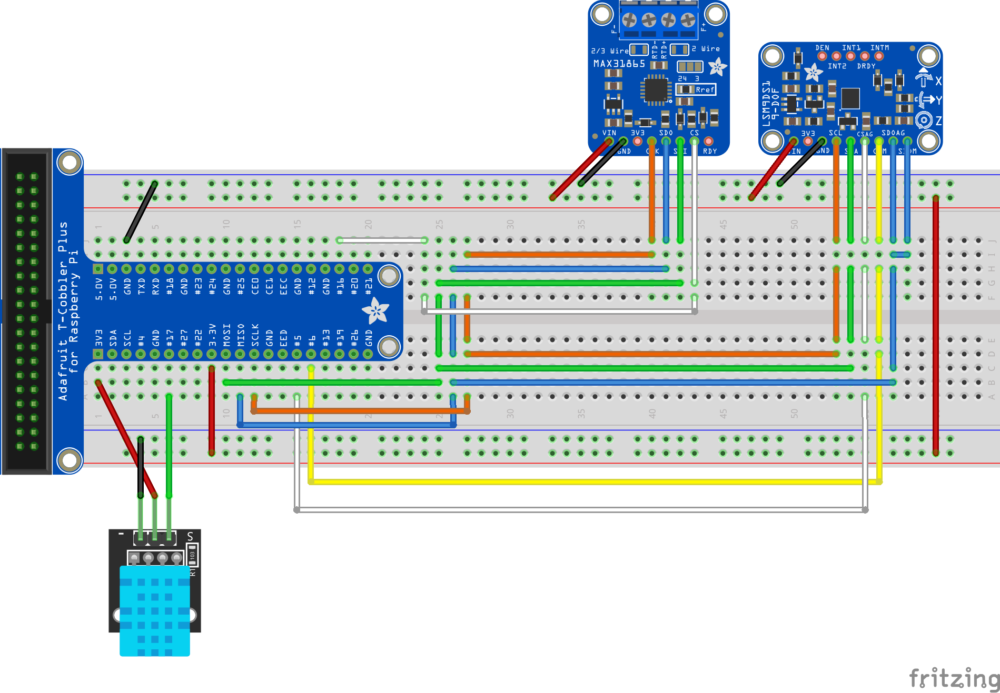

# CS321-007: HAB Sensor Data
### Objective: To expose sensor reading data via a realtime JSON formated data stream as well as a historic data file which contains all readings over a period of time.
[[Refrence Materials](references.md)] [[Project Slides](./AeroHAB6-Overview.pdf)]

## Sensors Used:
* Velleman VMA311 (DHT11) [[Vendor](https://www.microcenter.com/product/613629/velleman-dht11-digital-temperature-humidity-sensor-module-for-arduino)]
  * 3 or 5V power
  * 2.5mA max current use during conversion (while requesting data)
  * Good for 20-80% humidity readings with 5% accuracy
  * Good for 0-50°C temperature readings ±2°C accuracy
  * No more than 1 Hz sampling rate (once every second)
  * Weight: ¿?
* DHT22 [**¿ _VENDOR_ ?**]
  * 3 or 5V power
  * 2.5mA max current use during conversion (while requesting data)
  * Good for 0-100% humidity readings with 2-5% accuracy
  * Good for -40 to 80°C temperature readings ±0.5°C accuracy
  * No more than 0.5 Hz sampling rate (once every 2 seconds)
  * Weight: ¿?
* VK-162 G-Mouse GPS [[Vendor](https://www.amazon.com/gp/product/B078Y52FGQ)]
  * Data baud rate: 9600 (default) (optional: 4800, 19200, 38400, 57600, 115200, etc.) 
  * Data refresh rate: 1Hz-10Hz refresh rate (can be set to output data 1-10 times per second). 
  * NMEA-0183 protocol output 
  * C/A code, 1.023MHz stream
  * Receive Band: L1 [1575.42MHz]
  * Tracking Channels: 50
  * Support DGPS [WAAS, EGNOS and MSAS]
  * Positioning performance
    * 2D plane: 5m [average]
    * 2D plane: 3.5m [average], there DGPS auxiliary.
    * Drift: <0.02m / s
    * Timing Accuracy: 1us
    * Reference coordinate system: WGS-84
    * Maximum altitude: 18,000 m
    * Maximum speed: 500m / s
    * Acceleration: <4g
  * Electrical properties:
    * Tracking sensitivity:-160dBm
    * Acquisition sensitivity:-146dBm
    * Cold Start Time: 32s [average]
    * Warm start time: 32s [average]
    * Hot start time: 1s [average]
    * Recapture Time: 0.1s [average]
    * Operating temperature: -30 ℃ to +80 ℃
    * Package size:  49 * 38 * 16mm;
    * Cable length 2m
  * Weight: ¿?
* Adafruit LSM9DS1 [[Vendor](https://www.adafruit.com/product/3387)]
  * Accelerometer ranges: ±2/±4/±8/±16 g (no ±6 g range)
  * Magnetometer ranges: ±4/±8/±12/±16 gauss
  * Gyroscope ranges: ±245/±500/±2000 dps
  * Weight: 2.5g / 0.1oz 
* Adafruit MAX31865 [[Vendor](https://www.adafruit.com/product/3328)]
  * Amplifier to be used with PT100
  * Weight: 2.7g / 0.1oz 
* Adafruit PT100 [[Vendor](https://www.adafruit.com/product/3290)]
  * Usable temperature range: -200 to 550°C (-328°F to +1,022°F)
  * Uses 3-wire interface
  * ±0.5°C Accuracy from -10°C to +85°C
  * Weight: 19.3g / 0.7oz 

## Assembly

### LSM9Ds1 Pinout
  * VIN - This is the power pin. Chip includes a voltage regulator on board that will take either 3 or 5VDC.
    * RPi 3V3 to sensor VIN
  * 3V3 - This is the 3.3V output from the voltage regulator, you can grab up to 100mA from this if you like
    * _Not Used_
  * GND - Common ground for power and logic.
    * RPi GND to sensor GND
  * SCL - This is also the SPI clock pin, it's level shifted so you can use 3-5V logic input
    * RPi SCLK to sensor SCL
  * SDA - This is also the SPI MOSI pin, it's level shifted so you can use 3-5V logic input
    * Pi MOSI to sensor SDA
  * CSAG - This is the Accelerometer+Gyro subchip Chip Select, it's level shifted so you can use 3-5V logic input
    * RPi GPIO5 to sensor CSAG
  * CSM - This is the Magnetometer subchip Select, it's level shifted so you can use 3-5V logic input
    * RPi GPIO6 to sensor CSM
  * SDOAG - This is the Accelerometer+Gyro subchip MISO pin - it's 3V logic out, but can be read properly by 5V logic chips.
    * RPi MISO to sensor SDOAG AND sensor SDOM
  * SDOM - This is the Magnetometer subchip MISO pin - it's 3V logic out, but can be read properly by 5V logic chips.
    * RPi MISO to sensor SDOAG AND sensor SDOM

### MAX31865 Pinout
  * VIN - This is the power pin. Chip includes a voltage regulator on board that will take either 3 or 5VDC.
    * RPi 3V3 to sensor VIN
  * GND - Common ground for power and logic.
    * RPi GND to sensor GND
  * 3V3 - This is the 3.3V output from the voltage regulator, you can grab up to 100mA from this if you like
    * _Not Used_
  * CLK - This is the SPI Clock pin, its an input to the chip
    * RPi SCLK to sensor CLK
  * SDO - This is the Serial Data Out / Master In Slave Out pin, for data sent from the MAX31865 to your processor
    * RPi MISO to sensor SDO
  * SDI - This is the Serial Data In / Master Out Slave In pin, for data sent from your processor to the MAX31865
    * RPi MOSI to sensor SDI
  * CS - This is the Chip Select pin, drop it low to start an SPI transaction. Its an input to the chip
    * RPi GPIO16 to sensor CS
  * RDY - This is a data-ready indicator pin, you can use this pin to speed up your reads if you are writing your own driver. 
    * _Not Used_
  * Configuration Jumpers: 
    * Solder closed the jumper labeled 2/3 Wire and cut the wire connecting the left side of the 2-way jumper right above Rref. Then solder closed the right side labeled 3
  * Sensor Terminal Blocks:
    * Solder included terminal blocks to pads, or solder coresponding wires directly to pads. ([https://learn.adafruit.com/adafruit-max31865-rtd-pt100-amplifier?view=all](See))

## Setup
Do an update if you have not already done one today:
```bash
sudo apt update && sudo apt upgrade -y
```
If not already installed install Docker:
```bash 
curl -sSL https://get.docker.com | sh
```
Add your self to the docker group so you don't have to type sudo every time to use it:
```bash
boldsudo usermod -aG docker $USER
```
If not already installed install git:
```bash
sudo apt install git -y
```
Download the repo
```bash
git clone git@github.com:jflattery/cs321-sensordata.git
```
Change your currernt directory to the newly created one
```bash
cd cs321-sensordata
```
If not already enabled, enable SPI:
```bash
raspi-config nonint do_spi 0
```
Spin up a new container and LGTM:
```bash
docker run --privileged -it --rm --name conductor -v "$PWD":/usr/src/myapp -w /usr/src/myapp circuit-python:latest python app/conductor.py
```
## Example Output
```bash
user@raspberrypi:~/github/cs321-sensordata $ docker run --privileged -it --rm --name conductor -v "$PWD":/usr/src/myapp -w /usr/src/myapp circuit-python:latest python app/conductor.py

------------------------------------------------
2020-04-21 13:36:56.654825
External Temp: 21.271C
Internal Temp: 20.000C  Humidity: 43%
Acceleration (m/s^2): (-0.921,1.062,9.571)
Magnetometer (gauss): (2.627,2.627,2.627)
Gyroscope (degrees/sec): (29.908,-5.880,-7.228)
Internal Temp 2: 27.062C

------------------------------------------------
2020-04-21 13:36:57.399667
External Temp: 21.305C
Internal Temp: 20.000C  Humidity: 43%
Acceleration (m/s^2): (-0.930,1.062,9.581)
Magnetometer (gauss): (-0.072,-0.072,-0.072)
Gyroscope (degrees/sec): (30.459,-5.915,-6.711)
Internal Temp 2: 27.062C

------------------------------------------------
2020-04-21 13:36:58.654251
External Temp: 21.305C
Internal Temp: 20.000C  Humidity: 40%
Acceleration (m/s^2): (-0.920,1.074,9.592)
Magnetometer (gauss): (-0.720,-0.720,-0.720)
Gyroscope (degrees/sec): (29.803,-5.574,-6.134)
Internal Temp 2: 27.062C

------------------------------------------------
2020-04-21 13:36:59.400439
External Temp: 21.271C
Internal Temp: 20.000C  Humidity: 40%
Acceleration (m/s^2): (-0.928,1.067,9.549)
Magnetometer (gauss): (0.900,0.900,0.900)
Gyroscope (degrees/sec): (29.619,-5.556,-7.201)
Internal Temp 2: 27.062C

```

## Known Issue(s)
  * 
  *
